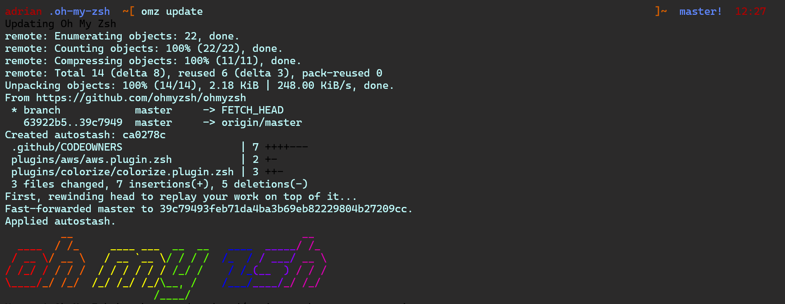

# Terminal-Config

## Vim

Vim is a text editor based on plugins.
After a few months using him, I actually improve my work flow and typing speed.

## Windows Terminal

The Windows Terminal is an easy way to use differents subsystems(like Ubuntu, Debian, Powershell, ...) into only one terminal.
It is also full customizable.

## Zsh

I am currently using a zsh shell into a Ubuntu terminal (behind the WSL system).
That shell allows me customizing all I want with themes and plugins.

